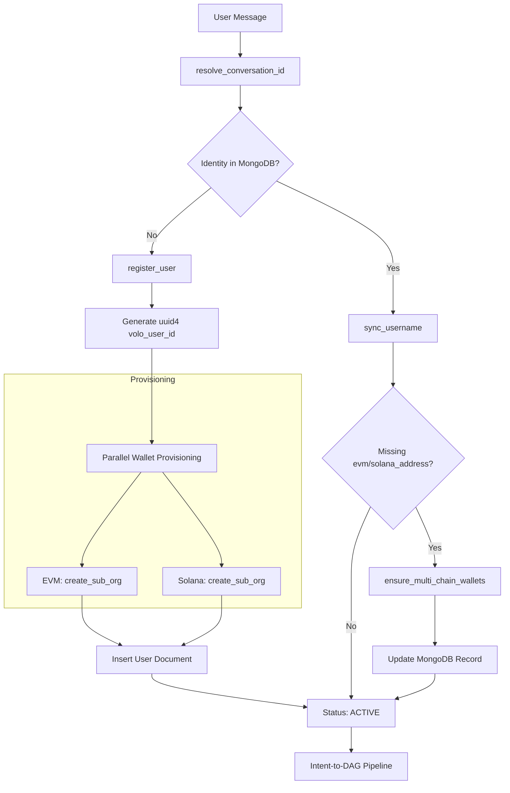

# Volo User Onboarding Guide

This document explains the lifecycle of a Volo user, from their first interaction to having fully provisioned multi-chain wallets.

---

## 1. Onboarding Flowchart

The following diagram visualizes how Volo handles new users and secures their cross-chain identity.

---

## 2. The Provisioning Process

Volo uses a **"Just-in-Time" (JIT) Provisioning** model. When a user is registered, the system creates two independent "Sub-Organizations" through the `AsyncIdentityService`:

### EVM Provisioning
*   **Engine:** `EvmWalletProvisioner`
*   **Result:** Generates a unique `sub_org_id` and an Ethereum-compatible `address`.
*   **Scope:** Used for Ethereum, Base, Arbitrum, and other EVM-compatible networks.

### Solana Provisioning
*   **Engine:** `SolanaWalletProvisioner`
*   **Result:** Generates a unique `solana_sub_org_id` and a Base58 `solana_address`.
*   **Scope:** Used exclusively for Solana mainnet/testnet interactions.

---

## 3. Account Linking & Multi-Identity

Volo allows you to link multiple external identities (e.g., Discord, Telegram, Website) to the same set of wallets.

1.  **Generate Link Token:** An existing user can request a short-lived token (`LinkTokenManager`).
2.  **Claim Token:** Using a new identity, the user provides the token.
3.  **Merge:** The `AsyncIdentityService` attaches the new `provider_user_id` to the existing `volo_user_id`.

---

## 4. First Intent (The "Hello World")

Once onboarded, your first transaction typically follows this pattern:

1.  **Deposit:** Send native gas (ETH or SOL) to your newly provisioned address.
2.  **Query:** Ask Volo `"What's my balance on Base?"`.
3.  **Action:** Ask Volo `"Swap 0.01 ETH for USDC on Base"`.

---

## 5. Technical Safety Note

*   **Idempotency:** Provisioning is atomic. If one chain fails, the system will attempt to `reprovision` it during the next interaction without creating duplicate identities.
*   **Isolation:** EVM and Solana sub-organizations are cryptographically isolated. Fees and treasury routing are handled per-ecosystem to prevent fund leakage.
