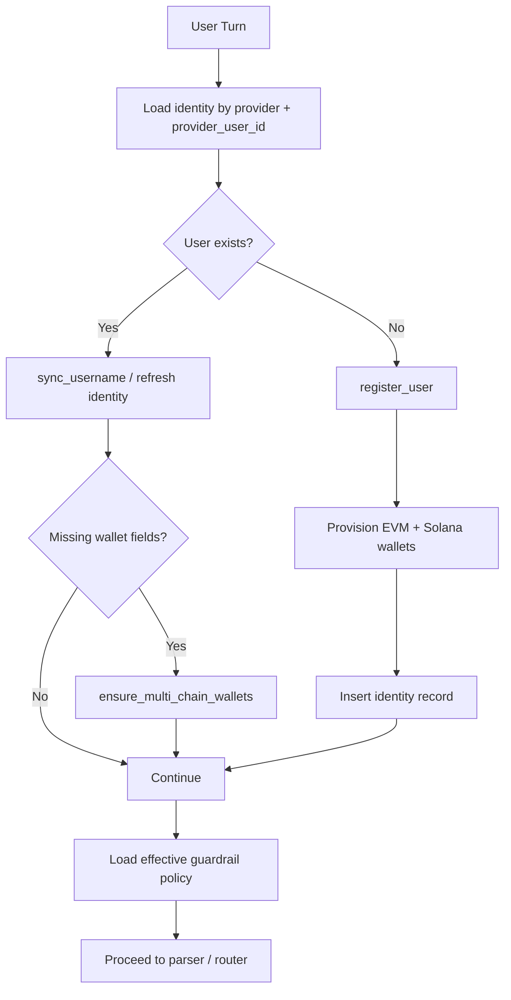

# Volo User Onboarding Guide

This document explains the current user onboarding and identity flow in Volo, based on the checked-in runtime.

It focuses on what the code is doing today:
- identity lookup and registration
- EVM + Solana wallet provisioning
- account linking
- policy loading before execution

---

## 1. Current Onboarding Flow

At the graph level, onboarding happens before parsing or execution in [graph/nodes/onboarding_node.py](/home/michael/dev-space/volo/volo_agent/graph/nodes/onboarding_node.py:1).

High-level flow:

---

## 2. Identity Model

Volo identifies a user by external identity first, then maps that identity to a single internal `volo_user_id`.

Current identity behavior lives in [core/identity/service.py](/home/michael/dev-space/volo/volo_agent/core/identity/service.py:1).

What is stored for an active user today:
- `volo_user_id`
- one or more external identities in `identities`
- EVM wallet fields such as `evm_sub_org_id` and `evm_address`
- Solana wallet fields such as `solana_sub_org_id` and `solana_address`
- metadata and activity flags

The service supports:
- lookup by provider identity
- registration of a new user
- wallet reprovision / repair for missing chain fields
- link-token based identity attachment

---

## 3. Wallet Provisioning

Wallet provisioning is implemented in [core/identity/provisioning.py](/home/michael/dev-space/volo/volo_agent/core/identity/provisioning.py:1).

Current behavior:
- EVM and Solana wallets are provisioned as separate bundles
- both provisioners are invoked during `register_user`
- the runtime expects each provisioner to return a dict with `sub_org_id` and `address`
- invalid or incomplete provisioner output fails onboarding clearly

Provisioners used by default:
- `EvmWalletProvisioner`
- `SolanaWalletProvisioner`

Operational note:
- onboarding is not only "first user registration"
- existing users can also be repaired if one side of the wallet bundle is missing

---

## 4. Link Tokens And Multi-Identity

Account linking is implemented through short-lived link tokens in [core/identity/link_tokens.py](/home/michael/dev-space/volo/volo_agent/core/identity/link_tokens.py:1).

Current behavior:
1. an existing Volo user can issue a link token
2. the token is stored with expiry and usage state
3. another provider identity can claim that token
4. the new identity is attached to the same `volo_user_id`

Important current details:
- tokens are short-lived
- token state is explicit: issued, used, revoked, expired
- the manager rejects invalid, used, revoked, or expired tokens

---

## 5. Policy Check Before Execution

The onboarding node now does more than identity setup.

Before the graph proceeds into parsing/execution, it also attempts to load the effective security policy for the resolved user. That logic lives in [graph/nodes/onboarding_node.py](/home/michael/dev-space/volo/volo_agent/graph/nodes/onboarding_node.py:1) and uses [core/security/policy_store.py](/home/michael/dev-space/volo/volo_agent/core/security/policy_store.py:1).

Current behavior:
- policy lookups are cached
- in-flight lookups are deduplicated
- failures can trigger a retry cooldown
- if policy verification cannot complete, execution is paused before any action runs

This matters because onboarding is now part of the safety boundary, not just identity creation.

---

## 6. First Real User Actions

Once a user is onboarded and policy is available, the normal first interactions are closer to:

1. fund the provisioned wallet
2. ask for a balance or portfolio-style query
3. submit a spend-capable request like a swap, bridge, transfer, or unwrap

In the current runtime, that turn then enters the conversational task-lane system and proceeds through:
- routing / task selection
- intent parsing
- plan resolution
- preflight
- execution

---

## 7. Practical Notes

- onboarding is turn-driven, not a separate standalone wizard
- user registration and wallet repair are both part of normal conversation startup
- EVM and Solana wallets are intentionally separate
- account linking exists, but it is identity attachment, not wallet merging
- policy verification is now a first-class precondition for execution

## 8. Source Of Truth

For current behavior, prefer these files over older diagrams or summaries:
- [graph/nodes/onboarding_node.py](/home/michael/dev-space/volo/volo_agent/graph/nodes/onboarding_node.py:1)
- [core/identity/service.py](/home/michael/dev-space/volo/volo_agent/core/identity/service.py:1)
- [core/identity/provisioning.py](/home/michael/dev-space/volo/volo_agent/core/identity/provisioning.py:1)
- [core/identity/link_tokens.py](/home/michael/dev-space/volo/volo_agent/core/identity/link_tokens.py:1)
